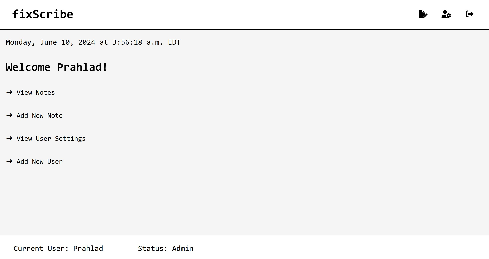

# fixScribe

fixScribe is a full-stack web application built using the MERN (MongoDB, Express.js, React.js, Node.js) stack. The app is designed to replace the current sticky note system used by a tech repair shop. It allows employees, managers, and admins to manage tech repair notes efficiently.



[Live Demo](https://fixscribe.onrender.com)

## Tech Stack

- **Frontend**: React.js
- **Backend**: Node.js, Express.js
- **Database**: MongoDB
- **Deployment**: Render
- **Authentication**: JSON Web Tokens (JWT)
- **Styling**: CSS
- **Testing**: React Testing Library
- **Version Control**: Git, GitHub
- **Other Tools**: Postman (API testing), VS Code (IDE)

## Features

- **Public Facing Page**: Displays basic contact information for the tech repair shop.
- **Employee Login**: Allows employees to log in to the notes app.
- **Welcome Page**: Provides a welcome page after login for easy navigation.
- **User Management**: Supports multiple user roles (Employees, Managers, Admins) with role-based access control.
- **Note Management**: Allows users to create, view, edit, and delete notes. Notes are assigned to specific users and have a ticket number, title, note body, created & updated dates, and status (OPEN or COMPLETED).
- **Security**: Requires users to log in at least once per week and provides a way to remove user access quickly if needed.
- **Mobile Compatibility**: Available in desktop mode but also designed to be accessible on mobile devices.

## Installation (If you want to setup and try the application on you own system)

### Prerequisites

Ensure you have the following installed on your local development machine:

- Node.js
- npm (Node Package Manager)
- MongoDB

### Setup

1. **Clone the repository:**

   ```bash
   git clone https://github.com/yourusername/fixScribe.git
   cd fixScribe
   ```

2. **Install dependencies for the client and server:**

    ```bash
    cd client
    npm install
    cd ../server
    npm install
    ```

3. **Set up environment variables:**

    ```bash
    DATABASE_URI=your_mongodb_uri
    ACCESS_TOKEN_SECRET=your_jwt_secret_token1
    REFRESH_TOKEN_SECRET=your_jwt_secret_token2
    ```

    Change the allowedOrigins variable to your localhost port (3500) in the allowedOrigins.js file.

4. **Run the application:**

    ```bash
    cd server
    npm run start
    ```

    In a new terminal:

    ```bash
    cd client
    npm start
    ```

## Usage

### Register and log in

1. Navigate to [http://localhost:3500](http://localhost:3500) in your browser.
2. Register a new account or log in with existing credentials.

### Manage repair jobs

1. Use the dashboard to create new repair jobs.
2. Update the status of existing jobs as repairs progress.

### Manage customer information

1. Add new customers and view their details.
2. Keep a record of past interactions and repairs for each customer.

## Project Structure

```bash
fixScribe
├── client                # Frontend application (React)
│   ├── public
│   └── src
├── server                # Backend application (Express.js)
│   ├── config
│   ├── controllers
│   ├── models
│   ├── routes
│   └── utils
├── .gitignore
├── README.md
├── UserStories.md
├── package-lock.json
├── package.json
└── .env.example
```

## Contributing

We welcome contributions to FixScribe! If you have suggestions for improvements or new features, please open an issue or submit a pull request.

## License

This project is licensed under the MIT License.

## Contact

If you have any questions or need further assistance, feel free to reach out:

Email: <prahlad.ranjit7@gmail.com>

GitHub: absolute-xero7
